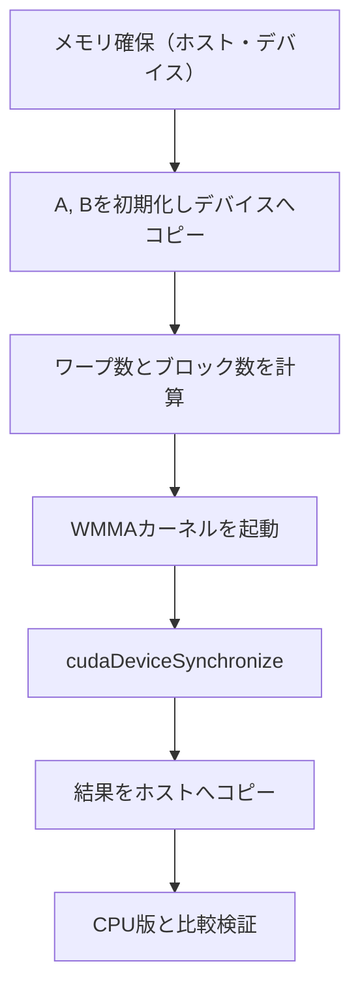

import Quiz from '@/components/content/Quiz.astro'

## 概要

前回のWMMA API理論に基づき，実際にTensor Coreを使った行列積のCUDAコードを実装し，コンパイル・実行して性能を測定する．Naive版との実行時間比較を通じて，Tensor Coreの実用的な性能向上を確認する．

## 主要な内容

### コード構成

WMMA APIを使った行列積の実装は以下の構成で記述する．

```cuda
#include <mma.h>       // WMMA APIのヘッダ
using namespace nvcuda;

const int N = 1024;     // 行列サイズ
const int TILE_SIZE = 16; // タイルサイズ（16×16×16）

__global__ void mm_tensor_fp32(half* a, half* b, float* c,
                                int m, int n, int k) {
    // ワープIDの計算
    int warpId = threadIdx.x / 32
               + (blockDim.x / 32) * (blockIdx.x + blockIdx.y * gridDim.x);
    int totalTiles = (n / TILE_SIZE) * (n / TILE_SIZE);
    if (warpId >= totalTiles) return;

    int tileRow = warpId / (n / TILE_SIZE);
    int tileCol = warpId % (n / TILE_SIZE);

    // fragmentの宣言と初期化
    wmma::fragment<wmma::matrix_a, 16, 16, 16, half, wmma::col_major> a_frag;
    wmma::fragment<wmma::matrix_b, 16, 16, 16, half, wmma::row_major> b_frag;
    wmma::fragment<wmma::accumulator, 16, 16, 16, float> c_frag;
    wmma::fill_fragment(c_frag, 0.0f);

    // k次元でタイル反復
    for (int t = 0; t < k; t += TILE_SIZE) {
        half* a_sub = a + tileRow * TILE_SIZE * n + t;
        half* b_sub = b + t * n + tileCol * TILE_SIZE;
        wmma::load_matrix_sync(a_frag, a_sub, n);
        wmma::load_matrix_sync(b_frag, b_sub, n);
        wmma::mma_sync(c_frag, a_frag, b_frag, c_frag);
    }

    // 結果をグローバルメモリに格納
    float* c_sub = c + tileRow * TILE_SIZE * n + tileCol * TILE_SIZE;
    wmma::store_matrix_sync(c_sub, c_frag, n, wmma::mem_row_major);
}
```

### コンパイルと実行

コンパイル時のアーキテクチャ指定が必須である．

```bash
# 正しいコンパイル（Ampere GPU向け）
nvcc -arch=sm_80 -o tensor tensor.cu

# 誤り: アーキテクチャ指定なし（WMMA関数が未定義エラー）
nvcc -o tensor tensor.cu  # エラー発生
```

### 重要な実装ポイント

- 入力（A, B）は`half`型，出力（C）は`float`型を使用
- ブロックサイズは128スレッド（4ワープ/ブロック）
- 行列サイズNがタイルサイズ（16）の倍数であることを事前に検証する
- `cudaDeviceSynchronize()`でカーネル完了を待機してからCPU側の検証を実行する



### 性能測定結果

Nsight Computeによる実行時間比較（行列サイズ 1024×1024）:

- Naive版（通常コア）: 2,540マイクロ秒（約2.5ミリ秒）
- WMMA版（Tensor Core）: 388マイクロ秒
- 性能向上: 約6.5倍

GPUカーネルのコードを書く手間はかかるが，Tensor Coreによる大幅な性能向上が得られる．

## まとめ

- WMMA APIを使ったTensor Coreプログラミングでは`-arch=sm_80`等のアーキテクチャ指定が必須である
- 入力は`half`精度，出力は`float`精度の組み合わせが一般的である
- Naive版と比較して約6.5倍の性能向上が実測された
- ワープIDの計算とタイル数の検証がカーネル実装の重要なポイントである

<Quiz questions={[
  {
    question: "WMMA APIを使った行列積で一般的に使用される入出力のデータ型の組み合わせはどれか？",
    options: [
      "入力: float，出力: float",
      "入力: half，出力: half",
      "入力: half，出力: float",
      "入力: double，出力: double"
    ],
    answer: 2,
    explanation: "WMMA APIでは入力（A，B行列）にhalf精度（FP16），出力（C行列）にfloat精度（FP32）を使用するのが一般的である．これにより入力の範囲を超える結果にも対応できる．"
  },
  {
    question: "WMMA版の行列積カーネルにおいて，ブロックサイズ128スレッドの場合，1ブロックあたりのワープ数はいくつか？",
    options: [
      "2ワープ",
      "4ワープ",
      "8ワープ",
      "16ワープ"
    ],
    answer: 1,
    explanation: "1ワープは32スレッドで構成されるため，ブロックサイズ128スレッドの場合は128 / 32 = 4ワープとなる．"
  },
  {
    question: "Nsight Computeによる測定で，行列サイズ1024×1024におけるWMMA版のNaive版に対する性能向上はおおよそ何倍か？",
    options: [
      "約2倍",
      "約4倍",
      "約6.5倍",
      "約10倍"
    ],
    answer: 2,
    explanation: "Naive版が2,540マイクロ秒，WMMA版が388マイクロ秒であり，約6.5倍の性能向上が実測された．"
  }
]} />
