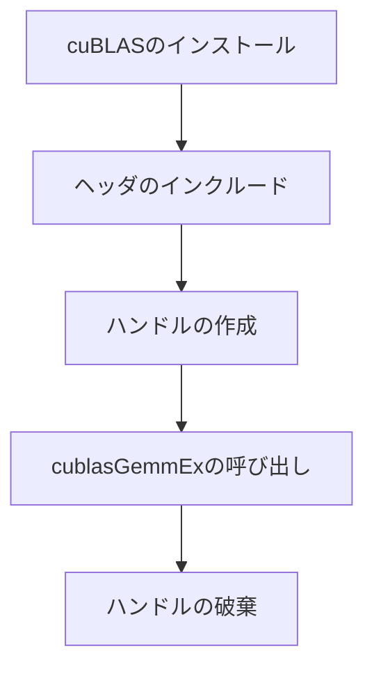

## 概要

`cuBLAS`はNVIDIAが提供する高度に最適化された線形代数ライブラリであり，GPUカーネルを自分で記述することなくTensor Coreを活用した行列積を実行できる．本レクチャーでは，cuBLASの使い方，WMMA APIとの違い，および性能比較を行う．

## 主要な内容

### cuBLASとWMMA APIの違い

- WMMA API: GPUカーネルを自分で記述する必要がある（ロード，MMA，ストアを明示的に実装）
- cuBLAS: NVIDIAが最適化済みのカーネルを提供し，関数呼び出しだけで行列積を実行できる

cuBLASはカスタマイズ性は低いが，NVIDIAのエンジニアによる最高レベルの最適化が施されている．

### cuBLASの行列積の式

cuBLASが実行する演算は以下の式で表される．

```
C = alpha × A × B + beta × C
```

- `alpha = 1.0`，`beta = 0.0`の場合，`C = A × B`（通常の行列積）
- `alpha`と`beta`の値でスケーリングと累算を制御できる

### cuBLASの使い方

```cpp
#include <cublas_v2.h>
#include <cuda_fp16.h>

int main() {
    // ハンドルの作成
    cublasHandle_t handle;
    cublasCreate(&handle);

    // スケーリング係数
    float alpha = 1.0f;
    float beta = 0.0f;

    // 行列積の実行
    cublasGemmEx(handle,
                 CUBLAS_OP_N,          // Aの転置（N=なし, T=転置）
                 CUBLAS_OP_N,          // Bの転置
                 n, n, n,             // M, N, K
                 &alpha,
                 d_a, CUDA_R_16F, n,  // A（半精度）
                 d_b, CUDA_R_16F, n,  // B（半精度）
                 &beta,
                 d_c, CUDA_R_32F, n,  // C（単精度）
                 CUBLAS_COMPUTE_32F,   // 計算は32ビットで実行
                 CUBLAS_GEMM_DEFAULT_TENSOR_OP);  // Tensor Core使用

    cublasDestroy(handle);
}
```

### 重要なパラメータ

- `CUBLAS_OP_N` / `CUBLAS_OP_T`: 行列の転置指定（転置によりrow major/column majorを変換可能）
- `CUDA_R_16F`: 半精度（FP16）のデータ型指定
- `CUDA_R_32F`: 単精度（FP32）のデータ型指定
- `CUBLAS_COMPUTE_32F`: 内部計算を32ビット精度で実行
- `CUBLAS_GEMM_DEFAULT_TENSOR_OP`: Tensor Coreを使用して実行

### コンパイル方法

cuBLASライブラリのリンクが必要である．

```bash
nvcc -arch=sm_80 -lcublas -o cublas_mm cublas.cu
```

`-lcublas`フラグを付けないとリンクエラーが発生する．



### 性能比較（行列サイズ 1024×1024）

Nsight Computeによる実行時間:

- Naive版（通常コア）: 約2,540マイクロ秒
- WMMA API版: 約388マイクロ秒
- cuBLAS版: 約107マイクロ秒

cuBLASはWMMA APIと比較しても約3.6倍高速であり，Naive版と比較すると約24倍の性能向上を達成している．

## コード例

Makefileを使った効率的なコンパイル:

```makefile
ARCH_FLAGS = -arch=sm_80
COMMON_FLAGS = -O3

naive:
    nvcc $(ARCH_FLAGS) $(COMMON_FLAGS) naive.cu -o naive

wmma:
    nvcc $(ARCH_FLAGS) $(COMMON_FLAGS) wmma.cu -o wmma

cublas:
    nvcc $(ARCH_FLAGS) $(COMMON_FLAGS) -lcublas cublas.cu -o cublas

clean:
    rm -f naive wmma cublas
```

## まとめ

- cuBLASはGPUカーネルを記述せずにTensor Coreを活用した行列積を実行できるライブラリである
- `cublasGemmEx`関数で入出力の精度，転置，Tensor Core使用の有無を細かく指定できる
- cuBLAS版はWMMA API版の約3.6倍，Naive版の約24倍高速である
- 最大の性能を求める場合は，自前のカーネル実装よりもcuBLASの利用が推奨される
