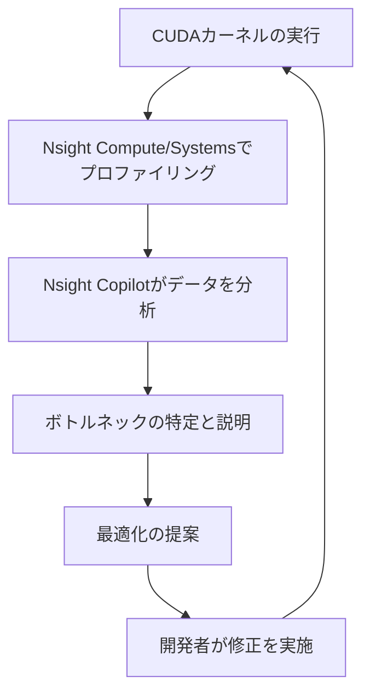

import Quiz from '@/components/content/Quiz.astro'

## 概要

NVIDIA Nsight Copilotは，AIを活用してGPUアプリケーションのプロファイリングと最適化を支援するツールである．Nsight SystemsやNsight Computeと統合され，パフォーマンスデータの解析を効率化する．

## 主要な内容

### Nsight Copilotとは

`Nsight Copilot`は，NVIDIAが提供するAIアシスタント機能であり，以下のNsightツールと連携して動作する．

- Nsight Systems: システム全体のタイムライン分析
- Nsight Compute: カーネルレベルの詳細プロファイリング

従来，プロファイリング結果の解釈には専門知識が必要だったが，Nsight Copilotは自然言語でパフォーマンスのボトルネックを説明し，最適化の提案を行う．

### 主要な機能

- パフォーマンスデータの自動解析と自然言語による説明
- ボトルネックの特定（メモリ律速，計算律速の判定）
- 最適化手法の提案（shared memoryの活用，coalescing改善など）
- Nsight ComputeのGPU Speed of Lightセクションの解釈支援
- Roofline Analysisの結果に基づく最適化方針の提示

### 活用シーン

### 使い方

Nsight CopilotはNsight ComputeおよびNsight Systemsの最新版に統合されている．プロファイリングを実行した後，Copilotパネルを開くことで，収集されたメトリクスに基づいた分析結果と最適化の提案を確認できる．

## まとめ

- Nsight Copilotは，AIを活用してGPUプロファイリング結果の解釈と最適化提案を行うツールである
- Nsight Systems/Computeと統合され，専門知識がなくてもボトルネックの理解が容易になる
- パフォーマンス最適化のイテレーションサイクルを高速化する

<Quiz questions={[
  {
    question: "Nsight Copilotが連携して動作するNVIDIAのプロファイリングツールはどれか？",
    options: [
      "CUDA Toolkit と Visual Profiler",
      "Nsight Systems と Nsight Compute",
      "cuBLAS と cuDNN",
      "NVML と nvidia-smi"
    ],
    answer: 1,
    explanation: "Nsight Copilotは，システム全体のタイムライン分析を行うNsight Systemsと，カーネルレベルの詳細プロファイリングを行うNsight Computeの2つのツールと連携して動作する．"
  },
  {
    question: "Nsight Copilotの主な役割として正しいものはどれか？",
    options: [
      "CUDAカーネルのソースコードを自動生成する",
      "プロファイリング結果を自然言語で解釈し，最適化の提案を行う",
      "GPUドライバのバージョンを自動更新する",
      "CUDAプログラムのコンパイルエラーを自動修正する"
    ],
    answer: 1,
    explanation: "Nsight Copilotは，AIを活用してプロファイリング結果の解釈を自然言語で説明し，ボトルネックの特定や最適化手法の提案を行うツールである．"
  }
]} />
